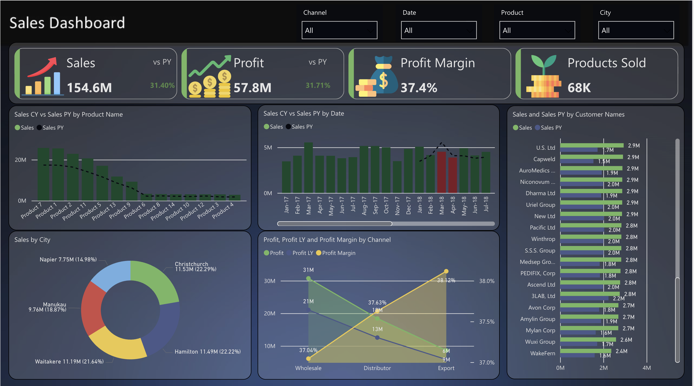
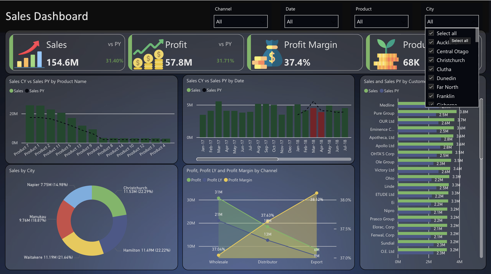
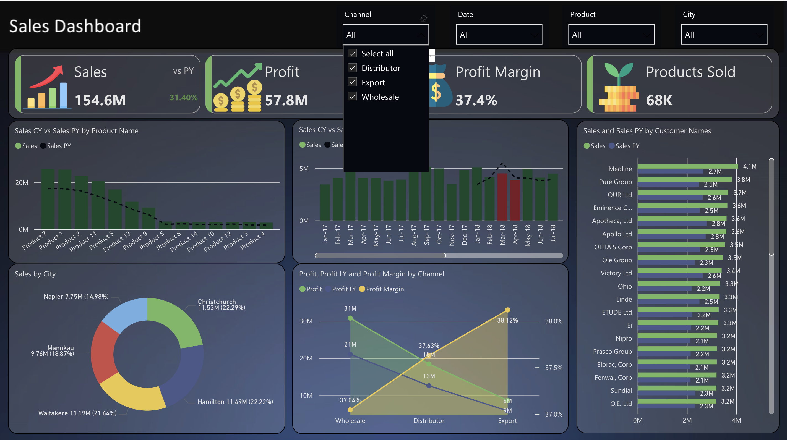
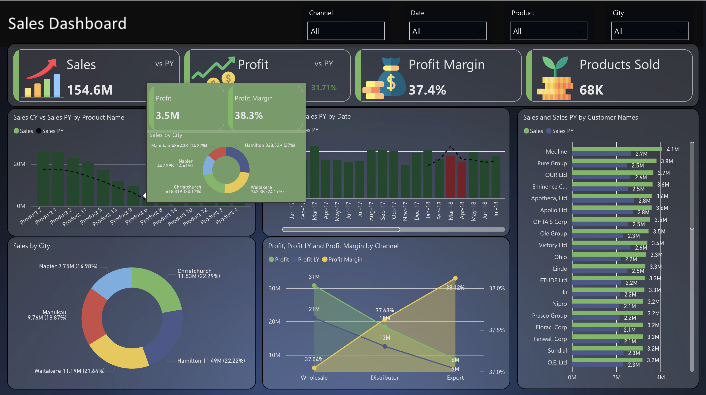

# 📊 Sales Dashboard - Power BI

🚀 **Welcome to the Sales Dashboard repository!** This project visualizes key sales insights using **Power BI**, helping businesses analyze performance, profit trends, and customer behavior.

🔗 **Live Power BI Dashboard:** [Click here to view](https://app.powerbi.com/view?r=eyJrIjoiZjE4NjZiNTEtNDViMC00ZDI5LWEyYWItMDEwOWYzZmUxYTc2IiwidCI6IjE3ZjFhODdlLTJhMjUtNGVhYS1iOWRmLTlkNDM5MDM0YjA4MCIsImMiOjF9)

## 📌 Overview

This **interactive Sales Dashboard** provides a **comprehensive view** of sales performance over time, breaking down **profit, revenue, customer segments, and sales channels**. With dynamic filtering options, businesses can analyze trends and make **data-driven decisions**.

---

## 🖥️ Features

✅ **Sales Overview** - Track total revenue, profit, and profit margins.  
✅ **Product Analysis** - Identify top-selling products and compare current vs. past sales.  
✅ **Customer Insights** - View sales distribution across different customers.  
✅ **Geographical Sales** - Understand city-wise sales contributions.  
✅ **Channel Performance** - Analyze sales by Wholesale, Distributor, and Export.  
✅ **Dynamic Filters** - Filter by Channel, Date, Product, and City for deep-dive insights.  
✅ **Interactive Tooltips** - Hover over visuals for detailed insights into profit margins, city-wise sales, and other key metrics.  

---

## 📸 Screenshots

🔹 **Dashboard Overview**  
  

🔹 **Filtering Options**  
  

🔹 **Sales Trends & Customer Analysis**  
  

🔹 **Tooltip Insights**  
  

---

## 📊 Technologies Used

- **Power BI** - Data visualization & interactive dashboard  
- **DAX** - Custom calculations & measures  
- **SQL (Optional)** - Data extraction & transformation  

---

## 🔧 How to Use

1️⃣ Open the **Power BI link** [here](https://app.powerbi.com/view?r=eyJrIjoiZjE4NjZiNTEtNDViMC00ZDI5LWEyYWItMDEwOWYzZmUxYTc2IiwidCI6IjE3ZjFhODdlLTJhMjUtNGVhYS1iOWRmLTlkNDM5MDM0YjA4MCIsImMiOjF9)  
2️⃣ Use the **filters** (Channel, Date, Product, City) to explore insights.  
3️⃣ Hover over visual elements for detailed metrics.  
4️⃣ Utilize **tooltips** to gain deeper insights into sales performance, city-wise distribution, and profit margins.  

---

## 📩 Contributing

Feel free to **fork** this repository, suggest enhancements, or explore different ways to visualize the data!  

📧 **Contact:** If you have any questions, reach out to me on **LinkedIn** or drop a comment.  

🌟 **If you like this project, don't forget to star the repository!** ⭐  

---

### 🔥 Powering Sales Decisions with Data! 🚀📈
